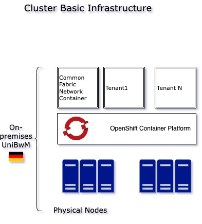
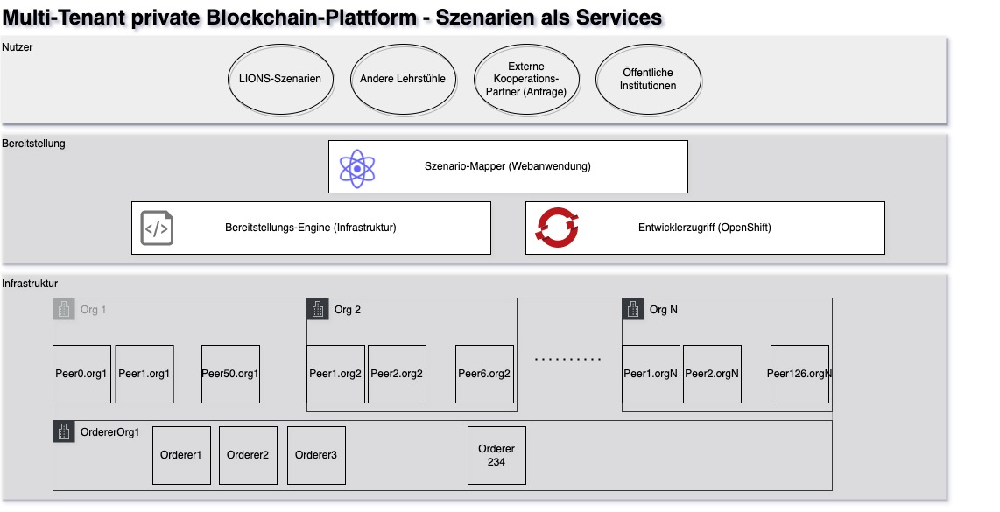

# Concept for a Modular Research Scenario Private Blockchain Platform

## Changelog
| Date | Revision | Author |
|------|----------|-------|
|11.02.2022| V0.1| Razvan Hrestic (razvan.hrestic@unibw.de)|
|27.02.2022| V0.2| Razvan Hrestic (razvan.hrestic@unibw.de)|
|21.03.2024| V0.3| Razvan Hrestic (razvan.hrestic@unibw.de)|

## Introduction

As part of the Project LIONS [Ledger Innovation and Operation Network for Sovereignty](https://www.unibw.de/lions) we plan to offer a managed permission Blockchain platform (some may describe it as Blockchain-as-a-Service) targeted specifically at research groups or institutions. The main idea is this: Focus on the value and create your smart contracts, tokens and blockchain-enabled applications and use our infrastructure and provisioning mechanisms to experiment with different network sizes and configurations.

A specific challenge for industry and research groups alike is that they do not have the required time and know-how to operate a Hyperledger Fabric platform. This usually means that one has to use cloud services (e.g. Amazon AWS, IBM Blockchain Platform, Microsoft Azure etc.) to setup their configurations. This is usually relatively easy, however there are still risks and limitations: Machine Sizes are predefined, there is little (or no) bandwidth or latency control - to use for stress tests and so on. Guidance for scaling and fine tuning the Fabric platform itself is scarce and usually not the research focus. For those who do have this focus we also plan to offer a parameterized setup for larger scale performance tests.

## High-level Platform Architecture

From the infrastructure perspective we have the following components

| Component name   |      Layer      |  Technology description  | Details |
|----------|:-------------|------:|:------:|
| Physical node |  Physical | Server | The physical servers|
| Storage nodes | Physical | Storage appliance | used for storing development-related data, container and virtual machine images |
| Container platform |   virtualization platform   |  RedHat OpenShift Container Platform (OCP)| Locally hosted edition of the OCP |
| Orchestration | container virtualization |  Kubernetes | Hosts and controls all services. It wraps containers in units called _pods_ |
| Individual containers| container | docker | Applications and other solution components run on containers |
| Virtual machines | operating system guest virtualization | VMware, Hyper-V and VirtualBox images supported | Virtual Machines can also be hosted alongside containers on our platform. Some legacy applications cannot be immediately ported to container technology or there are other isolation requirements |

## :arrows_counterclockwise: DevOps and CI/CD support for development 

The OpenShift Container Platform is designed for easy development and integration with common CI/CD-tools.

## :busts_in_silhouette: Actors and Organizations

This section provides an overview of the actor types used as a basis for implementing the underlying concepts. The goals and interests of these actors influence the system design.

For the scenario IT Supply Chain - development of complex software and cyber-physical systems - we have identified the following types of actors, grouped by system type.

### Inhouse Projects

| Actor  |  Details |
|----------|:-------------|
| Requiring organization| An entity - either private or public - which has the need for developing the new system.|
| Purchasing department| Handles supplier selection and ordering|
| Software Supplier| Organization (or individual) supplying third party software components.|
| Hardware Supplier | Organization (or individual) supplying third party hardware components.|
| Freelancer| Professionals involved in the development process for software intensive systems as external contractors. |
| Auditing organization| Independent certification organizations involved in e.g. certifiying the compliance of suppliers to specific standards - usually industry-specific norms.|
| Software/Hardware Developer| Organization-internal or external professionals who are tasked with implementing the required system functionality.|
| Quality Assurance (QA)| Professionals (internal or external) tasked with monitoring and reporting quality metrics.|
| Risk Management| Professionals tasked with assessing and monitoring project risks during the implementation phase, but also during operations.|
| Project Management| Professionals tasked with planning the project and monitoring progress. |
| System Analysts| Professionals tasked with eliciting and documenting system requirements. |
| Operators / Sysadmins| Professionals tasked with making sure the system is up and running correctly. They perform monitoring, maintenance and troubleshooting tasks. |
| Support| Single Point of Contact for system users during operational phase. The support organization makes sure that user queries are being answered and Change Requests are being tracked and implemented. |
| (Software- and Solution) Architects| Professionals tasked with designing the system, breaking it up into manageable components as well as making sure that stakeholder concerns are being addressed.|
| Sales organization| Organizational unit (internal or outsourced) tasked with selling the end-product after development.|

### Public Interest Systems

🚧 This section is currently under construction.

Here a different structure is proposed for systems where it is known or assumed from the start that they will affect more than simply one organization.

| Actor  |  Details |
|----------|:-------------|
|(Project) impulse giver| e.g. Startups, ventures of public/private enterprises, research organizations, R&D departments etc.|
|State/Political bodies|Political organizations or organizational units involved in the system design.|
|Directly affected groups|Groups of persons who know themselves to or have been identified (e.g. through an impact study) as having direct advantages or disadvantages from the System.|
|Indirectly affected groups|Groups of persons who are advantaged or disadvantaged, however indirectly and not through the first-order effects of the system. |
|Classcial roles| The roles described in the section above with the exception of the requiring organization still apply.|

## Scenario Architectures and Categories

Our proposed high-level system architecture consists of three layers:

1. Usage Layer - Includes scenarios from different organizations which have been approved for usage on our infrastructure.
2. Deployment Layer - Includes an (internal) application for configuring scenarios as well as a provisioning engine and developer self-service access through the OpenShift platform.
3. Infrastructure Layer - Consists of generic infrastructure components for Hyperledger Fabric. These are combined at the deployment layer to correspond to desired scenarios and cover individual requirements.

### Usage Layer

As our platform should be open to usage from other organizations, this layer sets the criteria. Generally we welcome submissions from other faculties, research groups or research institutes. It is also possible to get access to the platform as an external cooperation partner (e.g. a Research & Development project from the industry).

After submitting your request we will review and discuss your application. If this is approved, the scenario gets its own tenant in our infrastructure, with the required Fabric-capacity as well as development and monitoring components.

### Deployment Layer

After a scenario access request has been approved, we plan to use a scenario mapping webapplication in order to generate the configuration for the different components that can be provisioned and mapped for each indiviudal scenario (tenant).

The webapplication outputs a scenario configuration file in JSON-format which is then used by the Provisioning Engine.

The scenario web application is React based and is planned to be released as an open source artifact on GitHub. Our provisioning engine is based on multiple compoments such as Hyperledger Bevel, but mainly on a Tool called [Ansible](https://docs.ansible.com/ansible/latest/user_guide/index.html#getting-started).

These two components combined with the OpenShift virtualization platform are targeted at greatly reducing complexity of infrastructure setup for research scenarios and for developing own smart contracts (Chaincode in Fabric-terms). This complexity is partly necessary for the system to work, we believe, however, that current cloud-offerings e.g from IBM, Oracle, Microsoft etc. are not primarily targeted at the research community and while they also attempt to reduce complexity, they do not tend to individual requirements and cannot fulfill e.g. high-performance constraints or allow simulations on large Blockchain-networks. 

### Infrastructure Layer

The core Blockchain network is based on Hyperledger Fabric and consists of several pre-provisioned Organizations (in the technical, Fabric-specific sense of the word) with variable number of Peers and Channels. There are also a number of Orderer Organizations which host the Ordering Service. The number of Peers or Orderers per organization varies and can range from 1 to several hundred. Thus, requirements for scenarios with large number of Peers or Orderers can be satisifed.

Each scenario gets assigned the required number of resources (Organizations, Peers, Ordering Nodes). This can be changed dynamically, should it be necessary.

All Scenario data are isolated from each other by the use of Channels. Thus it is not possible for separate Scenarios to read each others data (separate Ledgers).

By using a pre-provisioned generic Fabric infrastructure in combination with Channels, we allow for a low barrier to usage while maintaing isolation and privacy of tenants.

### Requesting access for scenarios

You can request access through our E-Mail lions-community_[AT_unibw.de

### Lifecycle Policy

One of the requirements for the platform is that we need to make sure that the infrastructure is available to approved scenarios - current and future. Our computational resources are, however, limited and thus it is importat to set expiration dates on all scenarios. Generally, all projects get access for 6 months. After this period an extension is required to continue using the infrastructure. Extensions are also generally granted on a 6-month basis but may also be individually negotiated when appropriate.
