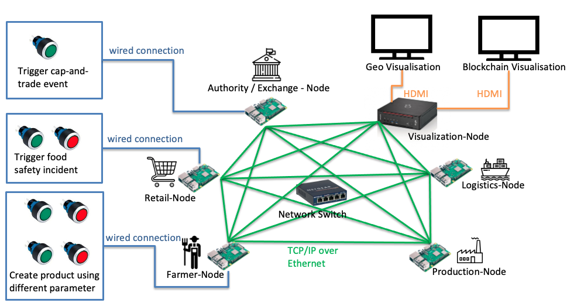
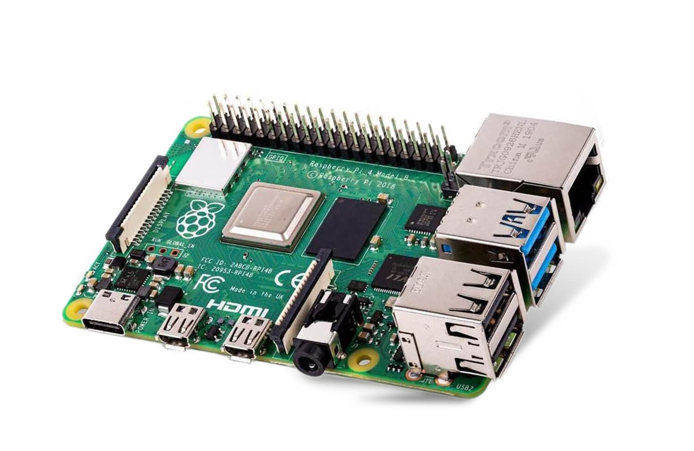
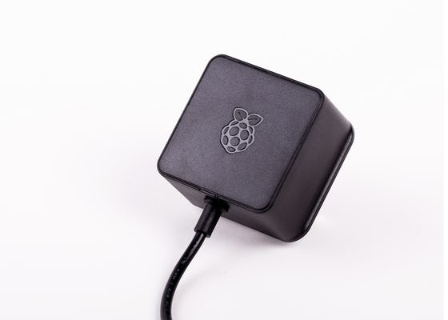
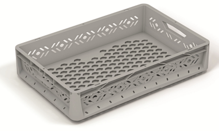
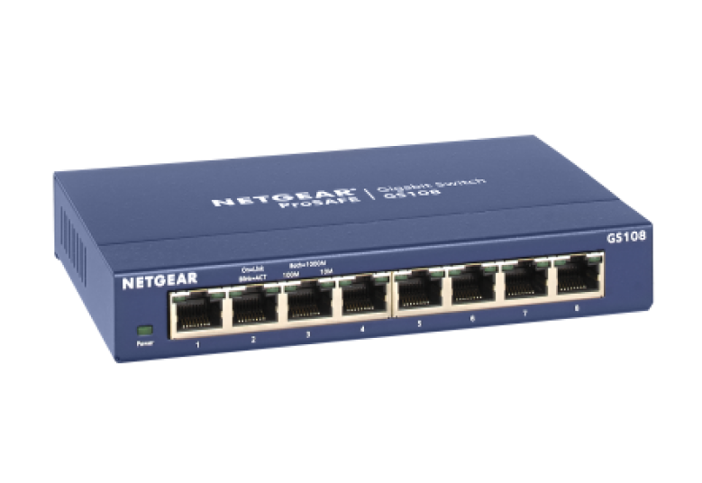
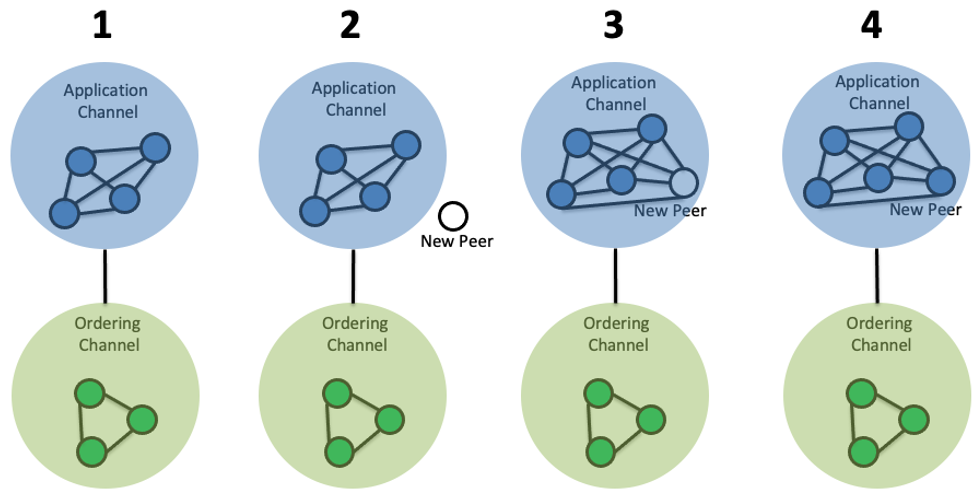

# Carbon Accounting Demonstrator 

This document describes all artefacts for rebuilding the carbon accounting demonstrator of the LIONS research project. The demonstrator consists of five Raspberry Pi's and a pocket pc running as a fully decentralized cluster to operate a Hyperledger Fabric blockchain network. The following picture shows the simplified setup of the cluster.

<a href="https://www.raspberrypi.com/products/raspberry-pi-4-model-b/">  Picture: https://www.raspberrypi.org/ 

1. [Bill of Materials (BOM)](#bill-of-materials-bom)
3. [Blockchain Network Setup](#blockchain-network-setup)
4. [Visualization](#visualization)

### Bill of Materials (BOM)
The following BOM lists the essential components for building the carbon demonstrator. Beside this BOM you may need further equipment such as, cables (ethernet, HDMI etc.), electrical wiring, buttons, 1-2 monitors and cable ties.

| Material                                     | Ammount | Reference                                                                                                                                       |
|----------------------------------------------|---------|-------------------------------------------------------------------------------------------------------------------------------------------------|
| Raspberry Pi 4 B+ (min. 4GB RAM)             | 5       |            |
| Raspberry Pi Power Supply                    | 5       |            |
| Box + Cover (e.g. eurobox 22L; 40x60x12,5cm) | 1       |                  |
| Network Switch 8xports                       | 1       |  |
| Pocket PC                                    | 1       | e.g. Fujitsu Esprimo Q556/2                                                                                                                     |

### Blockchain Network Setup
The usage of [minifabric](https://github.com/hyperledger-labs/minifabric) allows very straight processes for structing the network and the consortium. The following example depicts the stepwise process of onboarding a new organization to the consortium. 
 
| Step | Description |
|------|-------------|
| 1    | To prepare the existing network for the joining process of a new peer, run the mini-fabric command “channelquery”. As a result, the channel configuration file will be created.            |
| 2    | Modify the spec.yaml on a different machine as described above and run the “netup” command. A single peer will be started.            |
| 3    | Copy the join request, which is created by the new peer, to the configuration file. After a majority of network peers have signed the new config file, run “chan-nelupdate” to update the network. Join the single peer with the “nodeimport” command. Now the new peer is connected to the network and the order service but is not a member of the channel yet.            |
| 4    | Install the chaincode on the joined peer. After this, run the “approve” command on every peer, so the chaincode is approved. Now you can run the “commit” command to commit the chaincode. During this process the chaincode container on the new peer should be started. Run a simple “invoke” command to check if everything work as expected.            |

### Visualization
PICTURE + Description 
#### Carbon Visu
PICTURE + Description 
 
#### Transaction Visu

